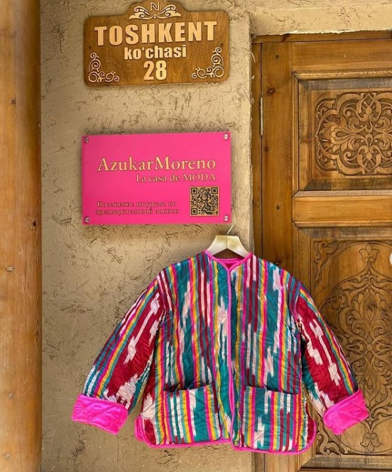

#### Web Technology coursework of 00013768 ####
Hosting URL: < https://365psd.com/psd/blitz-psd-theme-54140>
Website design template: < https://365psd.com/psd/blitz-psd-theme-54140>
Reset css: https://meyerweb.com/eric/tools/css/reset/reset.css
This website was created for Web Technology module for an Uzbek clothing brand called "Azukar Moreno" that specializes on creating traditional clothes. I have used the template from the internet on the website 365psd, the link is provided above. The website contains 6 html pages named index, about, partners, showroom, contact, and blog. I confirm that all of the html, css, and js files have been written from scratch by me, the student with ID number **00013768**. The website is hosted in Github, the link is provided above. The design includes animations such as carousel, which was created using JavaScript functions, animations that increase the scale of the element and transition. The contact.html file contains a form that validates the user input. If the fields are empty, the alert message will pop up. The style of the files is written in the styles.css file. There is additional file called reset.css which includes the code to reset the default style of browsers, which was taken from the website of Meyerweb. The fonts are taken from Google Fonts.
